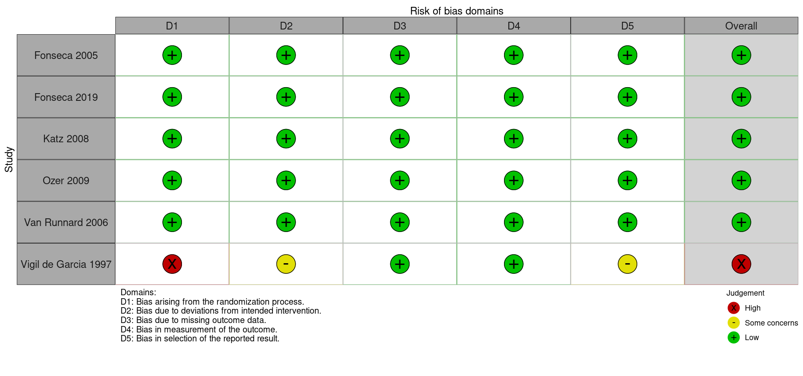
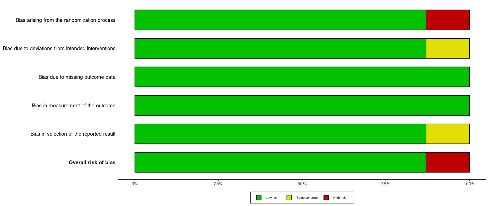

```{r setup, include=FALSE}
knitr::opts_chunk$set(comment=NA)
knitr::opts_chunk$set(echo=FALSE)
knitr::opts_chunk$set(out.width = '110%')
library(meta)
library(readxl)
library(PRISMA2020)
library(knitr)
library(tidyverse)
library(robvis)
```

# Dataset

```{r}
raw.data = read_excel("hellp_data.xlsx") 
attach(raw.data)
```

```{r}
kable(raw.data)
```

# Synthesis

**Pre-specified outcomes**

1.  Maternal Death
2.  Liver morbidity (hematoma, rupture, failure)
3.  Acute pulmonary edema
4.  Acute renal failure
5.  Dialysis
6.  Platelet transfusion
7.  Perinatal death

\newpage

## Maternal Death

Pairwise meta-analysis

```{r}
bin = metabin(ee,ne,ec,nc,sm="RR",method = "Inverse",random = F, studlab = id,subset = c(outcome =="Maternal death")) 
summary(bin) 
forest.meta(bin,pooled.events = T,xlim = c(.01,100), label.e = "Corticosteroids",label.c = "Placebo",just = "left", test.overall.common = T,colgap.left = ".5cm", fontsize = 7)
```

\newpage

Risk of bias

Summary traffic-light plot of risk-of-bias assessments

```{r}

```

Summary weighted barplot of risk-of-bias assessments

```{r}

```

\newpage

Subgroup analysis: Antepartum vs postpartum vs mixed

```{r}
subgr = update.meta(bin,subgroup = factor) 
forest.meta(subgr,pooled.events = T,xlim = c(.01,100), label.e = "Corticosteroids",label.c = "Placebo",just = "left", test.overall.common = T,colgap.left = ".5cm",col.subgroup = "black", fontsize = 7 )
```

\newpage

Subgroup analysis: Dexa vs Beta vs Prednisolone

```{r}
subgrc = update.meta(bin,subgroup = corticosteroid) 
forest.meta(subgrc,pooled.events = T,xlim = c(.01,100), label.e = "Corticosteroids",label.c = "Placebo",just = "left", test.overall.common = T,colgap.left = ".5cm",col.subgroup = "black", fontsize = 7)
```

\newpage

Sensitivity analysis: Low RoB

```{r}
sensit = update.meta(bin,subset = c(outcome =="Maternal death" & RoB=="low"))
forest.meta(sensit,pooled.events = T,xlim = c(.01,100), label.e = "Corticosteroids",label.c = "Placebo",just = "left", test.overall.common = T,colgap.left = ".5cm", fontsize = 7)
```

Sensitivity analysis: Studies with zero events included

```{r}
sensit = update.meta(bin,subset = outcome =="Maternal death", allstudies = T)
forest.meta(sensit,pooled.events = T,xlim = c(.01,100), label.e = "Corticosteroids",label.c = "Placebo",just = "left", test.overall.common = T,colgap.left = ".5cm", fontsize = 7)
```

\newpage

Funnel plot

```{r}
funnel(x = bin)
```

\newpage

## Acute pulmonary edema

```{r}
binpe = metabin(ee,ne,ec,nc,sm="RR",method = "Inverse",random = F, studlab = id,subset = c(outcome =="Maternal pulmonary edema")) 
summary(binpe) 
forest.meta(binpe,pooled.events = T,xlim = c(.01,100), label.e = "Corticosteroids",label.c = "Placebo",just = "left", test.overall.common = T,colgap.left = ".5cm", fontsize = 7)
```

\newpage

## Acute renal failure

```{r}
binrf = metabin(ee,ne,ec,nc,sm="RR",method = "Inverse",random = F, studlab = id,subset = c(outcome =="Maternal renal failure")) 
summary(binrf)
forest.meta(binrf,pooled.events = T, xlim = c(.01,100), label.e = "Corticosteroids",label.c = "Placebo",just = "left", test.overall.common = T,colgap.left = ".5cm", fontsize = 7)
```

\newpage

## Dialysis

```{r}
bindia = metabin(ee,ne,ec,nc,sm="RR",method = "Inverse",random = F, studlab = id,subset = c(zero =="F" & outcome =="Dialysis")) 
summary(bindia)
forest.meta(bindia,pooled.events = T, xlim = c(.01,100), label.e = "Corticosteroids",label.c = "Placebo",just = "left", test.overall.common = T,colgap.left = ".5cm", fontsize = 7)
```

\newpage

## Liver morbidity

```{r}
binhep = metabin(ee,ne,ec,nc,sm="RR",method = "Inverse",random = F, studlab = id,subset = c(outcome =="Maternal liver morbidity")) 
summary(binhep) 
forest.meta(binhep,pooled.events = T, xlim = c(.01,100), label.e = "Corticosteroids",label.c = "Placebo",just = "left", test.overall.common = T,colgap.left = ".5cm", fontsize = 7)
```

\newpage

## Platelet transfusion

```{r}
binpt = metabin(ee,ne,ec,nc,sm="RR",method = "Inverse",random = F, studlab = id,subset = c(outcome =="Platelet transfusion")) 
summary(binpt) 
forest.meta(binpt,pooled.events = T, xlim = c(.01,100), label.e = "Corticosteroids",label.c = "Placebo",just = "left", test.overall.common = T,colgap.left = ".5cm", fontsize = 7)
```

\newpage

## Perinatal death

```{r}
binpd = metabin(ee,ne,ec,nc,sm="RR",method = "Inverse",random = F, studlab = id,subset = c(outcome =="Perinatal death")) 
summary(binpd)
forest.meta(binpd,pooled.events = T,xlim = c(.01,100), label.e = "Corticosteroids",label.c = "Placebo",just = "left", test.overall.common = T,colgap.left = ".5cm", fontsize = 7)
```
